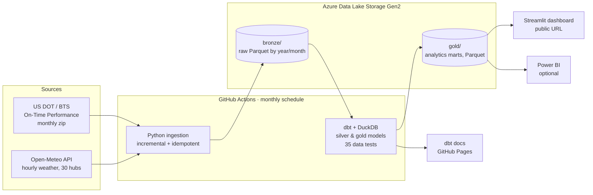

# ✈️ US Flight Delays Data Platform


 


A cloud data platform that ingests **every domestic US flight** (≈ 7M flights / year, US Department of
Transportation) and **hourly weather at the 30 busiest airports**, models them with **dbt** in a
bronze → silver → gold **Azure Data Lake**, refreshes itself **every month with GitHub Actions**, and
serves a public **Streamlit dashboard**.

**🔗 Live dashboard:** https://us-flight-delays-alvaro.streamlit.app · **📚 dbt docs & lineage:** https://alvarolorenzoa.github.io/us-flight-delays-platform

**Business questions**
1. How punctual is the US network, and how does it evolve month to month?
2. Which airlines, airports and routes are the most / least punctual?
3. What causes delay minutes (carrier, weather, air traffic system, late aircraft)?
4. **How much does bad weather at the origin airport increase the probability of a delayed departure?**
5. Do delays snowball during the day?

---

## Architecture



| Layer | Tech | What happens |
|---|---|---|
| **Ingestion** | Python, requests, pandas | Detects the latest month published by BTS, downloads only missing months (idempotent), keeps 32 columns, writes Parquet partitioned by `year/month`. Weather: one Open-Meteo call per month for all 30 hubs, in local time, with rate-limit back-off. |
| **Storage** | Azure Data Lake Storage Gen2 | `bronze/` (immutable raw extracts) and `gold/` (marts). The runner restores bronze from Azure, so each run only downloads new months. |
| **Transformation** | dbt + DuckDB | `staging` (typing, dedup with surrogate keys) → `intermediate` (hour-level join of every flight to the weather at its origin) → `marts` (star schema + 7 analytics marts written back to the lake as Parquet). |
| **Data quality** | dbt tests + pytest | 35 tests: uniqueness, not-null, referential integrity, accepted values/ranges, row-count reconciliation between layers, business rules (e.g. cancelled flights have no arrival delay). 11 unit tests for the ingestion code. |
| **Orchestration / CI-CD** | GitHub Actions | `ci.yml`: unit tests + full dbt build on an offline synthetic lake on every push. `pipeline.yml`: monthly production run + dbt docs published to GitHub Pages. |
| **Serving** | Streamlit, Plotly | Public dashboard reading the gold layer from Azure (read-only SAS). |

### dbt lineage

```
bronze.flights ─► stg_flights ─┐
                               ├─► int_flights_weather ─► fct_flights ─► mart_kpis_monthly
bronze.weather ─► stg_weather ─┘                              │         mart_carrier_monthly
                                                              │         mart_airport_daily
seeds: carriers, hub_airports ─► dim_carrier, dim_airport ────┤         mart_route_monthly
                                  dim_date ───────────────────┘         mart_delay_causes_monthly
                                                                        mart_weather_impact
                                                                        mart_hourly_profile
```

Key modelling decisions
- **Surrogate key**: the source has no primary key → `md5(date, carrier, flight number, origin, dest, scheduled time)`, de-duplicated with `qualify row_number()`.
- **Weather join at hour grain**: BTS times are local `hhmm` integers (`2400` = midnight), converted to a local timestamp and joined to the Open-Meteo hour requested in the airport's local timezone.
- **On-time definition**: arrival < 15 minutes late, the official US DOT definition; cancelled and diverted flights are excluded from punctuality and counted separately.
- **Gold as files**: analytics marts are dbt `external` models (Parquet) so any consumer (Streamlit, Power BI, Databricks) can read them straight from the lake.

---

## Key findings

_Filled in from the production data after the first run - see the dashboard for the latest month._

---

## Run it locally

```bash
git clone https://github.com/alvarolorenzoa/us-flight-delays-platform.git
cd us-flight-delays-platform
python -m venv .venv && source .venv/bin/activate
pip install -r requirements.txt

# Option A - offline demo in 1 minute (synthetic data in the real source formats)
python tests/make_fixture_lake.py --lake data/lake --rows 30000 --months 6
LAKE_PATH=$PWD/data/lake DUCKDB_PATH=$PWD/data/warehouse.duckdb \
  bash -c 'dbt seed --project-dir dbt --profiles-dir dbt && dbt build --project-dir dbt --profiles-dir dbt'

# Option B - real data (downloads ~30 MB per month)
python -m ingestion.pipeline --months 3

streamlit run app/streamlit_app.py
```

Set `AZURE_STORAGE_CONNECTION_STRING` to sync the lake with Azure; without it everything runs locally.

## Project structure

```
├── ingestion/            # Python: sources -> bronze, Azure sync, pipeline entrypoint
├── dbt/
│   ├── models/staging/   # typed, de-duplicated sources
│   ├── models/intermediate/
│   ├── models/marts/core/       # star schema (fct_flights + dimensions)
│   ├── models/marts/analytics/  # gold marts written to the lake as Parquet
│   ├── seeds/            # carriers, hub airports (coordinates)
│   ├── macros/           # generic test accepted_range, hhmm helpers
│   └── tests/            # singular business-rule tests
├── app/                  # Streamlit dashboard
├── tests/                # pytest + synthetic data generator (offline CI)
└── .github/workflows/    # ci.yml, pipeline.yml (monthly + dbt docs to Pages)
```

## Data sources
- **Bureau of Transportation Statistics (US DOT)** - Reporting Carrier On-Time Performance (public domain).
- **Open-Meteo** Historical Weather API (ERA5 reanalysis), CC BY 4.0.

---

**Álvaro Lorenzo Antón** · Computer Engineering + Business Administration @ UC3M ·
[LinkedIn](https://www.linkedin.com/in/alvaro-lorenzo-anton-466574291) · [GitHub](https://github.com/alvarolorenzoa)
